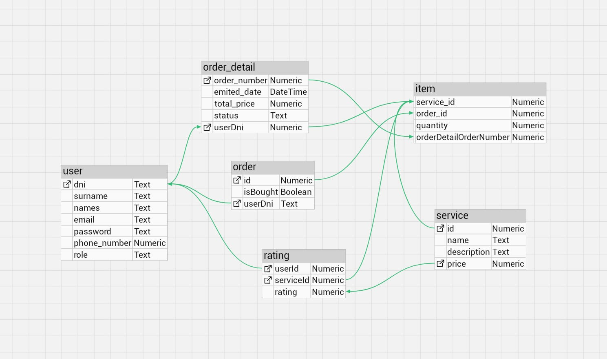
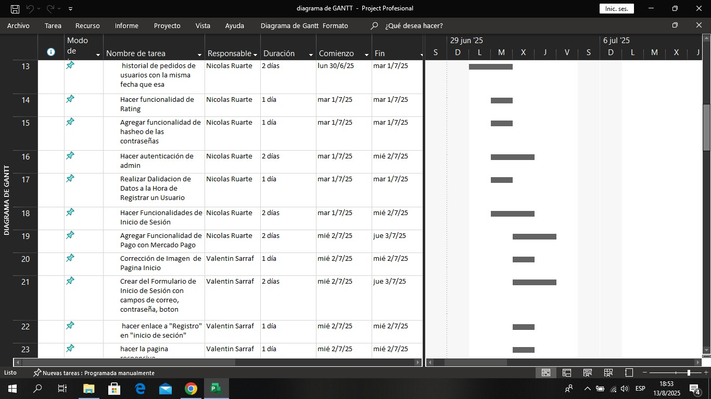

# Página para las olimpiadas

# MyFlight – Un sistema de reserva de vuelos web

MyFlight es una página web que permite a los usuarios registrarse, buscar y reservar vuelos. También, podrán visualizar el precio total y recibir una confirmación inmediata por correo electrónico con todos los detalles del viaje.

Este proyecto simula un sistema de reserva de vuelos, que incluye interfaz gráfica, backend y almacenamiento de datos.

---

# User Story

## Como cliente

Tendrá acceso a un formulario de registro e inicio de sesion a tarvés de un botón.

Podrá ver información de destinos turísticos en la página principal.

Podrá calificar el servicio a través de un sistema de estrellas.

Podrá acceder a un formulario para ingresar sus datos, destino, fecha de viaje, etc., al momento de comprar un pasaje.

Podrá comprar uno o más paquetes turísticos.

Dispondrá de un carrito virtual donde podrá añadir la cantidad de paquetes que desee y comprarlos en una sola transacción.

Tendrá acceso a un historial de compras.

Tendrá la posibilidad de anular una compra.

---

## Como administrador

Podrá iniciar sesión en la sección de administración con credenciales predefinidas.

Tendrá acceso a la página principal de administración con un botón “Admin” visible en el navbar.

Podrá ver y gestionar todos los pedidos registrados en la base de datos.

Tendrá la posibilidad de filtrar las órdenes por:

o	Estado (pendiente, aceptado, anulado).
o	Producto incluido en la orden.
o	Rango de precios.
Podrá modificar el estado de cualquier pedido.
Podrá visualizar la lista de servicios disponibles en el sitio.
Tendrá la opción de filtrar servicios por:
o	Nombre.
o	Rango de precio.
o	Rango de calificación (1 a 5 Estrellas).
Podrá consultar el historial de ventas, mostrando únicamente las órdenes aceptadas.
Tendrá acceso a enlaces directos a la página individual de cada producto desde las tablas.

---

**Diseño grafico:**  

La interfaz es intuitiva y responsiva para una mejor experiencia del usuario.  

---

## Tecnologías Utilizadas

- Bootstrap y Axios (Librerias frontend)
- TypeORM, Morgan, ExpressJS, Valibot, Bcrypt, Cookie-parser, pg, Reflect-metadata, Mercado pago, module-alias, dotenv, jsonwebtoken y class-validator (Librerias backend)
- HTML, CSS y JavaScript (Frontend)
- TypeScript (Backend)
- Postgre (Base de datos)
- Git y GitHub 

---

## Equipo de Desarrollo – Curso 7ºI

| Nombre                                | Roles                 |
|---------------------------------------|-----------------------|
| Arian Valentín Sarraf Bazan           | Líder de Proyecto     |
| Miqueas Nicolás Ruarte                | Programador           |
| Héctor Eduardo Daga Morales           | Analista de Datos     |
| Fabio Yala Cabrera                    | Diseñador Gráfico     |

---

## Diagrama Base de datos

---

## Cronograma 

---
# Página para las olimpiadas

## Links útiles

[Buenas prácticas para los commits](https://github.com/nicolasRuarte/olimpiadas-fvhn/blob/main/archivos/buenas-practicas-commits.md)
[Convenciones](https://github.com/nicolasRuarte/olimpiadas-fvhn/blob/main/archivos/convenciones.md)

